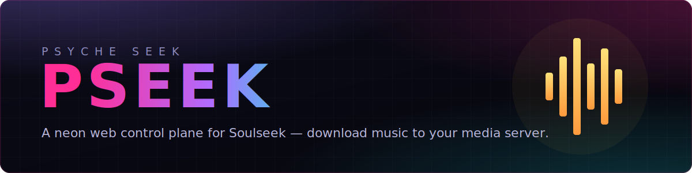

<!--
  SPDX-FileCopyrightText: 2026 Psyche Seek Contributors
  SPDX-FileCopyrightText: 2013-2025 Nicotine+ Contributors
  SPDX-License-Identifier: GPL-3.0-or-later
-->

<p align="center">
  
</p>

<p align="center">
  <b>Psyche Seek</b> (<code>pseek</code>) is a self-hosted web app for finding and downloading music over the
  <a href="https://www.slsknet.org/news/">Soulseek</a> network — built to run headless on your media server,
  right next to the *arr stack.
</p>

<p align="center">
  
  
  
  
  
</p>

---

## What is this?

The *arr stack (Sonarr, Radarr, Lidarr…) automates almost everything on a home
media server — but **music is the gap**. Lidarr can't touch Soulseek, which is
where the rare, out-of-print and lossless releases actually live.

**Psyche Seek fills that gap.** It's a brand-new **React + TypeScript** front-end
and a small **FastAPI** daemon that turn a headless server's Soulseek connection
into a clean, fast web app — search, download, browse and play, from any browser
on your network. No desktop environment, no GTK, just a tab.

Under the hood it uses **[Nicotine+](https://github.com/nicotine-plus/nicotine-plus)**
purely as the Soulseek protocol engine. Everything you see and touch is new.

> Think of it as **Lidarr's missing Soulseek companion**: park it next to Plex or
> Jellyfin, point it at your download directory, and pull music straight into your
> library.

## Highlights

- 🔎 **Search** the Soulseek network with recent-search history and a filter syntax
  (`minbitrate:`, `minfilesize:`, `isvbr`, …).
- 🗂️ **Results** grouped by user and folder, with size, bitrate, encoding and
  attributes — every column sortable, free slots surfaced, one-click downloads.
- 👤 **Browse a user's whole share** straight from a result, and grab any folder.
- ⬇️ **Downloads manager** — live progress and speed, pause / cancel, clear
  completed, sort by any column.
- 📁 **File browser** for your downloaded and shared directories: an expanding tree
  with audio metadata (artist / title / album / year), rename, delete, and
  configurable download + share folders.
- ▶️ **Built-in player** that keeps playing as you move between pages (Spotify-style),
  reads tags for artist/title/album, and lets you queue tracks — with an animated
  canary-song equalizer while it plays.
- 💬 **Chat** view for recently received messages.
- ⚙️ **Settings** for your session, connection status and directories.

## Design

Psyche Seek ships a flat **"neon-wire" cyberpunk** look. The full design system —
palette, typography and motion — is documented in **[DESIGN.md](DESIGN.md)**.

## Architecture

```
┌──────────────────────────────┐
│  daemon-ui/  React 19 + TS    │  Vite SPA — the entire UI
└──────────────┬───────────────┘
               │  /api  /auth   (REST + SPA served on :7007)
┌──────────────┴───────────────┐
│  pynicotine/daemon/  FastAPI  │  headless daemon (this project)
└──────────────┬───────────────┘
               │
┌──────────────┴───────────────┐
│  pynicotine/  Nicotine+ core  │  Soulseek protocol engine (dependency)
└──────────────────────────────┘
```

- `daemon-ui/` — the React + TypeScript + Vite single-page app.
- `pynicotine/daemon/` — a FastAPI daemon that exposes the REST API and serves the
  built SPA on `127.0.0.1:7007`.
- `pynicotine/` — the vendored **Nicotine+** core, used only as the Soulseek engine.

## Quick start

**Requirements:** Python 3 and Node.js.

```bash
# 1. Bootstrap: creates .venv, installs deps, builds the web UI
./build.sh

# 2. Configure your Soulseek credentials in ~/.config/nicotine/config
#    (the [server] section: login / passw)

# 3. Run the daemon (must use the venv Python)
.venv/bin/python pseek -d
```

Then open **http://localhost:7007** and sign in with your Soulseek credentials.
On a server, put it behind your reverse proxy of choice.

### Developing the UI

Run the daemon for the API, then start Vite with hot-reload:

```bash
cd daemon-ui
npm run dev        # http://localhost:5173, proxies /api and /auth → :7007
```

Edit `.tsx` files for instant HMR. Restart the daemon after Python changes.
Lint with `npm run lint`; run backend tests with `python3 -m unittest`.

## License

Psyche Seek is free software, released under the
[GNU General Public License v3.0 or later](https://www.gnu.org/licenses/gpl-3.0-standalone.html),
inherited from Nicotine+.

© 2026 Psyche Seek Contributors · © 2001–2025 Nicotine+, Nicotine and PySoulSeek Contributors
